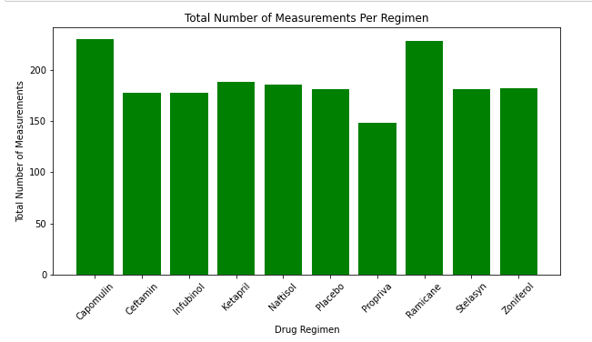
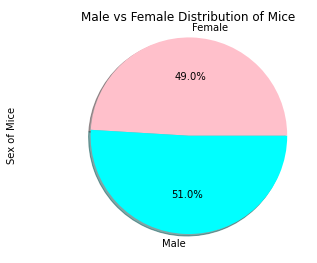
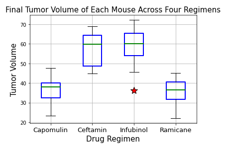
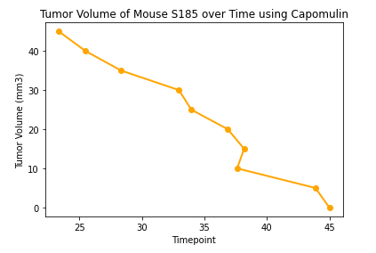
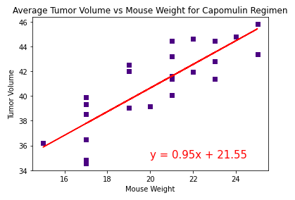

# Plotting_Pharmaceutical_Data_with_Matplotlib
Analyzing pharmaceutical study data with graphs using Matplotlib

The code in this project is to analyze the provided drug regimen data and mouse tumor data. 

## Table of Contents 
*[General info](#General-info)
*[Technologies](#technologies)
*[Setup](#setup)
*[Images](#images)
*[Overview](#overview)

## General Info
This code is to analyze the tumor volume in mice in order to evaluate which drug regimen is working best an. 

## Technologies
Project is created with:
*Pandas 1.0.5
*Jupyter Notebook 4.6.3
*Matplotlib 3.3.2

## Setup
To run the code, open it with jupyter Notebook.

## Images

## Overview
The code gives a lot of information which can be viewed in the code and in the images folder. From the graphs we can see that there is a strong positive correlation for average tumor volume and the mouse weight when using the Capomulin regimen. With a single mouse we see there's a negative trend over time in which the tumor volume decreases while using Capomulin. 