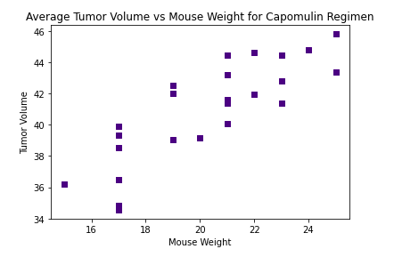

# Plotting_Pharmaceutical_Data_with_Matplotlib

The code in this project is to analyze the provided drug regimen data and mouse tumor data. 

## Table of Contents 
* [General info](#General-info)  
* [Technologies](#technologies)  
* [Setup](#setup)  
* [Images](#images)  
* [Overview](#overview)  

## General Info
This code is to analyze the tumor volume in mice in order to evaluate which drug regimen is working best an. 

## Technologies
Project is created with:  
*Pandas 1.0.5  
*Jupyter Notebook 4.6.3  
*Matplotlib 3.3.2  

## Setup
To run the code, open it with jupyter Notebook.

## Images

## Overview
The code gives a lot of information which can be viewed in the code, and the graphs can also be viewed in the images folder. Overall, several graphs were made reflecting different information. One was made for the total measurements pure regiment, another comparing male vs female mice by count. The other graphs focus on certain regimens with Capomulin being the featured regimen for the last couple of graphs. There is a lot of information that can be gleaned from these. The Capomulin and Ramicane regimens have the lower final tumor volumes compared to the Ceftamin and Infubinol regimens and more data should be procured for those. 